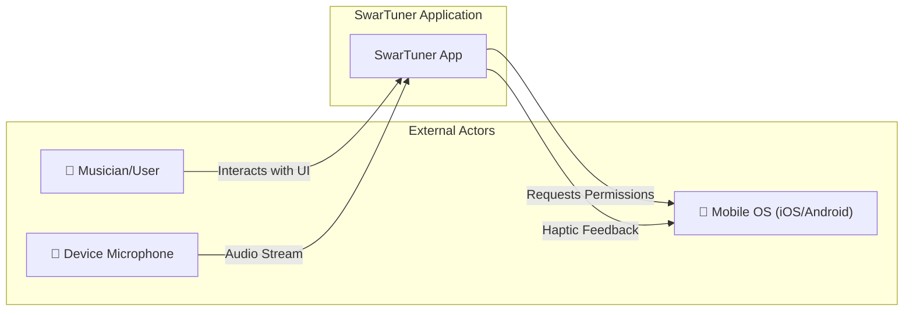
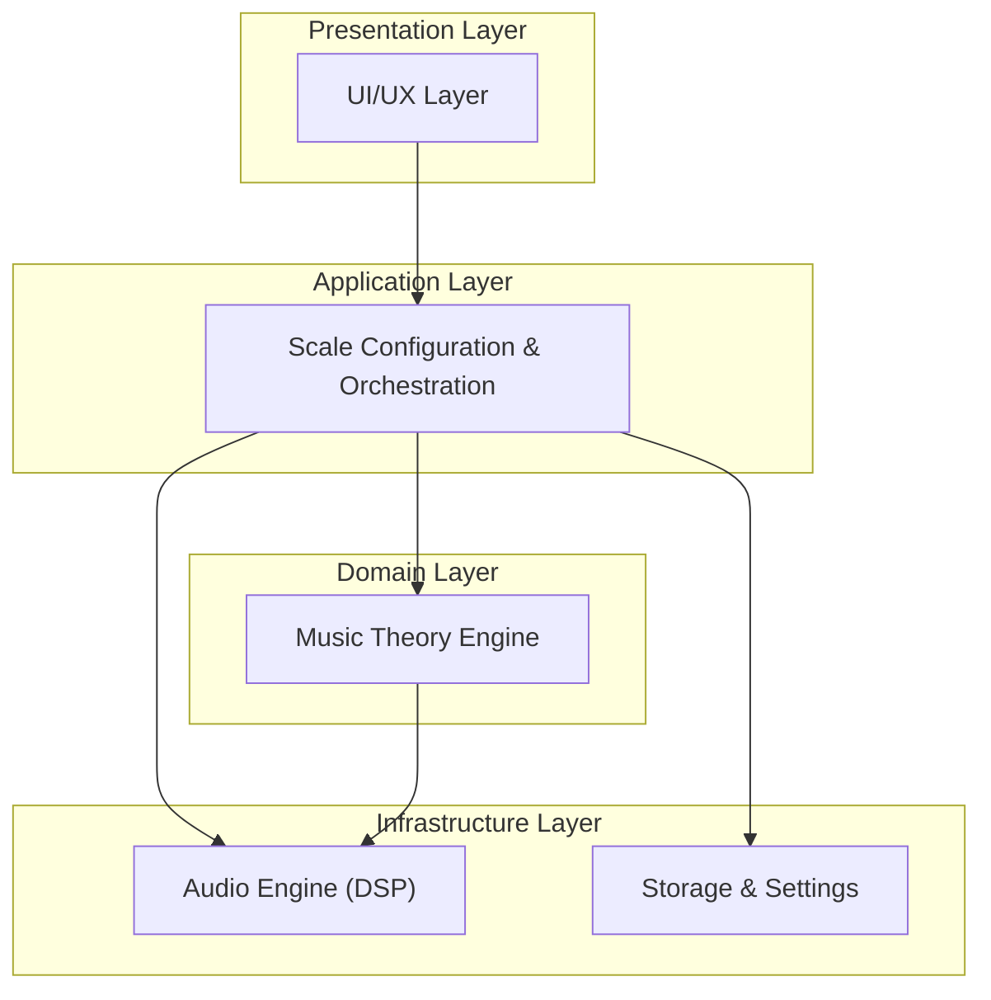
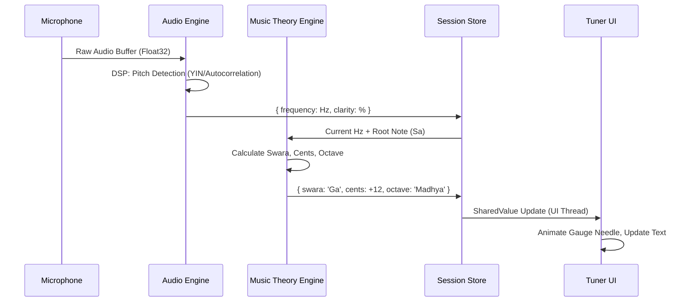
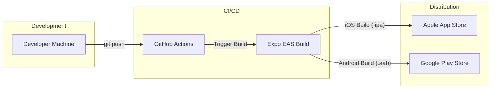

# SwarTuner - System Architecture Overview

> **Version:** 1.0  
> **Status:** Draft  
> **Date:** February 6, 2026  
> **Source:** [BRD](file:///f:/Development/SwarTuner/documents/BRD.md), [User Stories](file:///f:/Development/SwarTuner/documents/USER_STORIES.md), [UI/UX Guidelines](file:///f:/Development/SwarTuner/documents/UI_UX_GUIDELINES.md)

---

## 1. Introduction

### 1.1 Purpose
This document provides a system-wide architectural overview for the **SwarTuner** application. It establishes the foundational context, technology stack, and cross-cutting concerns that apply to all modules. Individual module-level High-Level Design (HLD) and Low-Level Design (LLD) documents are referenced from this overview.

### 1.2 Scope
SwarTuner is a **mobile-first, offline-capable** application for Indian Classical Musicians. It provides real-time pitch detection and feedback using Indian music terminology (Swaras) and **Just Intonation** tuning.

### 1.3 Definitions & Acronyms

| Term | Definition |
| :--- | :--- |
| **Swara** | A note in the Indian musical scale (Sa, Re, Ga, Ma, Pa, Dha, Ni). |
| **Just Intonation** | A tuning system based on pure harmonic ratios, as opposed to Equal Temperament. |
| **Cents** | A logarithmic unit of pitch interval. 100 cents = 1 semitone. |
| **Saptak** | An octave in Indian music (Mandra/Lower, Madhya/Middle, Taar/Higher). |
| **DSP** | Digital Signal Processing. |
| **f0** | Fundamental Frequency (the perceived pitch of a sound). |

---

## 2. System Context Diagram

This diagram shows SwarTuner in its operational environment.

---

## 3. High-Level Architecture

SwarTuner follows a **Layered Architecture** with a clear separation of concerns. This promotes testability, maintainability, and allows independent evolution of each layer.

### 3.1 Architectural Pattern: Layered Architecture

### 3.2 Module Decomposition

The system is decomposed into 5 core modules:

| Module | Responsibility | HLD | LLD |
| :--- | :--- | :--- | :--- |
| **Audio Engine** | Microphone I/O, buffering, pitch detection (DSP). | [HLD](file:///f:/Development/SwarTuner/documents/architecture/audio-engine/HLD.md) | [LLD](file:///f:/Development/SwarTuner/documents/architecture/audio-engine/LLD.md) |
| **Music Theory Engine** | Swara mapping, Just Intonation, Cents calculation. | [HLD](file:///f:/Development/SwarTuner/documents/architecture/music-theory-engine/HLD.md) | [LLD](file:///f:/Development/SwarTuner/documents/architecture/music-theory-engine/LLD.md) |
| **UI/UX Layer** | All screens, components, animations (React Native). | [HLD](file:///f:/Development/SwarTuner/documents/architecture/ui-ux-layer/HLD.md) | [LLD](file:///f:/Development/SwarTuner/documents/architecture/ui-ux-layer/LLD.md) |
| **Storage & Settings** | Persistence (MMKV), global state (Zustand). | [HLD](file:///f:/Development/SwarTuner/documents/architecture/storage-settings/HLD.md) | [LLD](file:///f:/Development/SwarTuner/documents/architecture/storage-settings/LLD.md) |
| **Scale Configuration** | "Find My Sa" wizard, manual key selection. | [HLD](file:///f:/Development/SwarTuner/documents/architecture/scale-configuration/HLD.md) | [LLD](file:///f:/Development/SwarTuner/documents/architecture/scale-configuration/LLD.md) |

---

## 4. Technology Stack

| Layer | Technology | Version | Rationale |
| :--- | :--- | :--- | :--- |
| **Framework** | React Native (Expo) | SDK 52+ | Cross-platform, OTA updates, rich ecosystem. |
| **Language** | TypeScript | 5.x (Strict) | Type safety for complex music logic. |
| **UI Styling** | NativeWind | 4.x | Tailwind CSS-in-JS for rapid, consistent styling. |
| **Animations** | React Native Reanimated | 3.x | High-performance, UI-thread animations for the Gauge. |
| **Audio I/O** | expo-av | Latest | Cross-platform microphone access. |
| **Pitch Detection** | pitchy / Custom | - | Optimized autocorrelation-based pitch detection. |
| **State Management** | Zustand | 4.x | Lightweight, minimal boilerplate global state. |
| **Persistence** | react-native-mmkv | 2.x | Fast synchronous key-value storage. |
| **Haptics** | expo-haptics | Latest | Consistent haptic feedback across platforms. |
| **Blur Effects** | expo-blur | Latest | Native glassmorphism effects. |

---

## 5. Cross-Cutting Concerns

### 5.1 Latency & Performance
*   **Target:** < 50ms from audio input to UI update (NFR-1).
*   **Strategy:** Use small audio buffers (2048 samples @ 44.1kHz ≈ 46ms). Animations run on the UI thread via Reanimated SharedValues, bypassing the JS bridge.

### 5.2 Offline Capability
*   **Requirement:** Core tuner must function without network (NFR-3).
*   **Strategy:** All logic is pure TypeScript with no external API calls. All assets are bundled.

### 5.3 Responsiveness
*   **Requirement:** UI adapts to phones and tablets (NFR-4).
*   **Strategy:** Use NativeWind responsive modifiers (`md:`, `lg:`) and `useSafeAreaInsets` for dynamic padding.

### 5.4 Platform Parity
*   **Requirement:** Consistent functionality on Android 14+ and iOS 17+ (NFR-2).
*   **Strategy:** Use Expo's abstraction layer. Platform-specific code is isolated within the Audio Engine (e.g., audio session configuration).

### 5.5 Error Handling
*   Microphone permission denial is handled with a dedicated "Permission Denied" screen.
*   Low signal/quiet input displays a "Listening..." state with a ghosted UI.

### 5.6 Accessibility
*   Touch targets are minimum 44x44 points (US-5.3).
*   Large, readable fonts for hands-free practice (US-4.1).

---

## 6. Data Flow Overview

---

## 7. Deployment Architecture

---

## 8. Related Documents

*   [Business Requirements Document (BRD)](file:///f:/Development/SwarTuner/documents/BRD.md)
*   [User Stories](file:///f:/Development/SwarTuner/documents/USER_STORIES.md)
*   [UI/UX Guidelines](file:///f:/Development/SwarTuner/documents/UI_UX_GUIDELINES.md)
