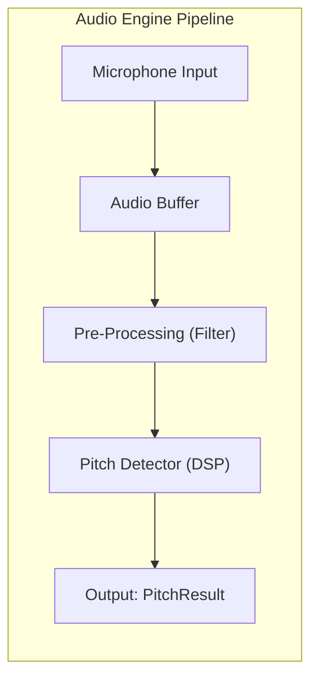
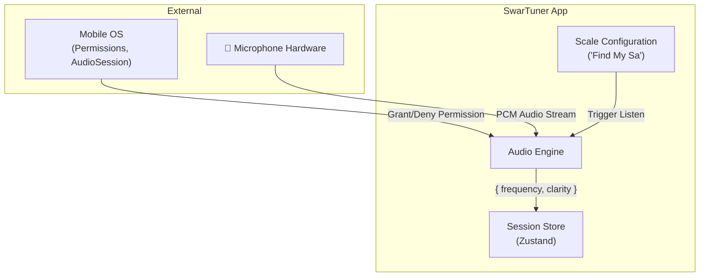

# Audio Engine - High-Level Design (HLD)

> **Module:** Audio Engine  
> **Version:** 1.0  
> **Date:** February 6, 2026  
> **Parent:** [System Architecture Overview](file:///f:/Development/SwarTuner/documents/architecture/OVERVIEW.md)

---

## 1. Module Overview

### 1.1 Purpose
The Audio Engine is the **sensory layer** of SwarTuner. It is responsible for capturing raw audio from the device microphone, processing it in real-time, and extracting the fundamental frequency (pitch) from the user's voice.

### 1.2 Scope
*   Microphone permission handling.
*   Audio stream capture and buffering.
*   Real-time pitch detection (Digital Signal Processing).
*   Emitting pitch data to the application layer.

### 1.3 Out of Scope
*   Musical interpretation of the pitch (handled by Music Theory Engine).
*   UI rendering.
*   Recording or playback of audio.

---

## 2. Architectural Pattern: Pipeline Architecture

The Audio Engine follows a **Pipeline Architecture** pattern. Data flows unidirectionally through a series of processing stages, each transforming the input for the next stage.

**Why Pipeline?**
*   **Modularity:** Each stage is independent and can be tested/swapped in isolation.
*   **Performance:** Stages can be optimized individually. Future support for native/WASM processing is possible by swapping the `Pitch Detector` stage.
*   **Clarity:** The data flow is explicit and easy to reason about.

---

## 3. Context Diagram

This diagram shows how the Audio Engine interacts with other modules and external systems.

---

## 4. Key Components

| Component | Responsibility |
| :--- | :--- |
| `AudioInputManager` | Manages the lifecycle of audio recording (start, stop, pause). Handles OS-level permissions and audio session configuration. |
| `AudioBuffer` | A fixed-size circular buffer that accumulates audio samples before processing. |
| `PreProcessor` | Applies optional filtering (e.g., low-pass, noise gate) to clean the signal. |
| `PitchDetector` | The core DSP algorithm that analyzes the buffer and returns the fundamental frequency (f0) and a confidence score (clarity). |
| `PitchResult` | An immutable data structure holding the output: `{ frequency: number, clarity: number }`. |

---

## 5. Data Flow

1.  **Trigger:** The Tuner Screen mounts, or the "Find My Sa" flow starts.
2.  **Permission Check:** `AudioInputManager` checks for `RECORD_AUDIO` / Microphone permission. If denied, it emits an error state.
3.  **Start Recording:** On permission grant, the native audio session is configured (e.g., iOS `AVAudioSession` category set to `measurement`).
4.  **Buffering:** Raw PCM samples (Float32, 44.1kHz) are pushed into the `AudioBuffer`.
5.  **Processing Trigger:** When the buffer reaches its target size (e.g., 2048 samples), it is passed to the `PreProcessor`.
6.  **Pre-Processing:** A noise gate is applied. If the signal is below a threshold, a "silent" result is emitted.
7.  **Pitch Detection:** The `PitchDetector` analyzes the buffer using an autocorrelation-based algorithm (e.g., YIN, McLeod Pitch Method).
8.  **Output:** A `PitchResult` is emitted to the Session Store, which then triggers the Music Theory Engine.

---

## 6. Technology Choices

| Concern | Technology | Rationale |
| :--- | :--- | :--- |
| **Audio I/O** | `expo-av` (Recording API) | Cross-platform, well-maintained, integrates with Expo ecosystem. |
| **Pitch Detection Algorithm** | `pitchy` library (or custom implementation) | Provides McLeod Pitch Method, known for accuracy on monophonic vocal input. Open source. |
| **Buffer Implementation** | Standard Float32Array | Efficient, directly usable by DSP algorithms. |

---

## 7. Non-Functional Requirements

| NFR | Target | Strategy |
| :--- | :--- | :--- |
| **Latency (NFR-1)** | < 50ms (audio-to-output) | Use buffer size of 2048 samples @ 44.1kHz (~46ms). Avoid JS-heavy processing; consider Worklets for Phase 2. |
| **Reliability** | Handle interruptions gracefully | Listen for OS interruption events (e.g., incoming calls). Pause recording and resume without crashing. |
| **Battery** | Minimize drain | Only run audio capture when the Tuner screen is active. Release resources immediately on `stop()`. |

---

## 8. Error Handling

| Error Condition | Handling Strategy |
| :--- | :--- |
| Permission Denied | Emit `PermissionDeniedError`. UI displays a dedicated screen with a link to OS settings. |
| Low Signal / Silence | Emit `PitchResult` with `clarity: 0`. UI shows "Listening..." state. |
| Audio Session Interruption | Pause recording, save state. Resume on interruption end. |
| Hardware Failure | Emit `HardwareError`. UI shows a generic error message. |

---

## 9. Related Documents

*   [Audio Engine LLD](file:///f:/Development/SwarTuner/documents/architecture/audio-engine/LLD.md)
*   [Music Theory Engine HLD](file:///f:/Development/SwarTuner/documents/architecture/music-theory-engine/HLD.md)
