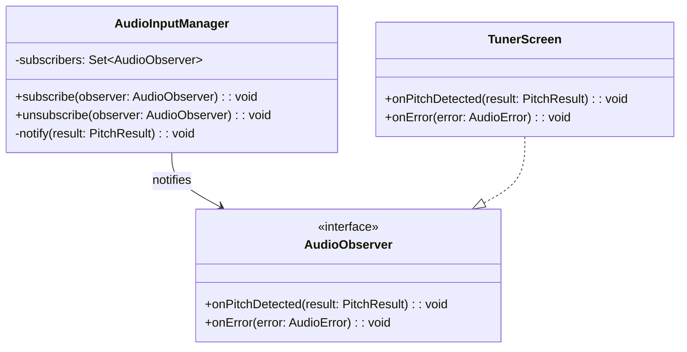
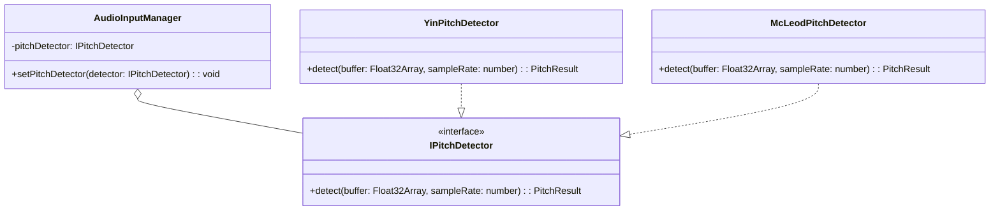
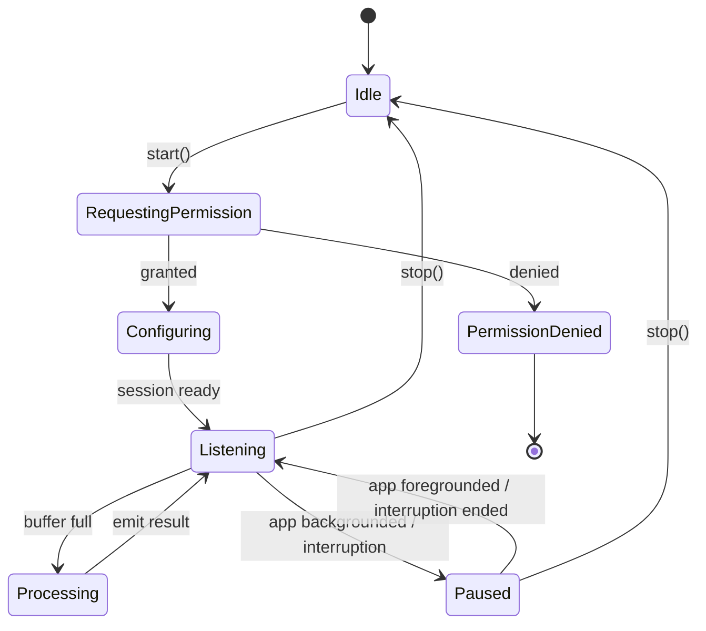

# Audio Engine - Low-Level Design (LLD)

> **Module:** Audio Engine  
> **Version:** 1.0  
> **Date:** February 6, 2026  
> **Parent:** [Audio Engine HLD](file:///f:/Development/SwarTuner/documents/architecture/audio-engine/HLD.md)

---

## 1. Introduction

This document provides the detailed Low-Level Design for the Audio Engine module. It covers class structures, interfaces, algorithms, and design patterns used.

---

## 2. Design Patterns

### 2.1 Observer Pattern (Pub/Sub)
The `AudioInputManager` uses the Observer pattern to emit audio data and pitch results to subscribers without tight coupling.

*   **Subject:** `AudioInputManager`
*   **Observers:** `TunerScreen`, `FindMySaScreen`



### 2.2 Strategy Pattern (Swappable Pitch Detector)
The pitch detection algorithm is abstracted behind an interface, allowing different implementations (e.g., YIN, Autocorrelation, McLeod) to be swapped.

*   **Context:** `AudioInputManager`
*   **Strategy Interface:** `IPitchDetector`
*   **Concrete Strategies:** `YinPitchDetector`, `McLeodPitchDetector`



---

## 3. Class Diagrams & Interfaces

### 3.1 `PitchResult` Interface

```typescript
/**
 * [WHAT]: Represents the output of a single pitch detection cycle.
 * [WHY]: Immutable data structure for clean data flow between modules.
 */
interface PitchResult {
  /** The detected fundamental frequency in Hertz. 0 if no pitch detected. */
  frequency: number;

  /** Confidence of the detection (0.0 to 1.0). Values < 0.8 are considered unreliable. */
  clarity: number;

  /** Timestamp of the detection for potential latency debugging. */
  timestamp: number;
}
```

### 3.2 `AudioError` Type

```typescript
/**
 * [WHAT]: Union type for all possible audio engine errors.
 * [WHY]: Enables exhaustive error handling in the UI layer.
 */
type AudioError =
  | { type: 'PERMISSION_DENIED' }
  | { type: 'HARDWARE_UNAVAILABLE' }
  | { type: 'SESSION_INTERRUPTED'; reason: string }
  | { type: 'UNKNOWN'; message: string };
```

### 3.3 `IPitchDetector` Interface

```typescript
/**
 * [WHAT]: Abstraction for pitch detection algorithms.
 * [WHY]: Strategy pattern allows swapping algorithms without changing the Audio Manager.
 */
interface IPitchDetector {
  /**
   * Analyzes an audio buffer and returns the detected pitch.
   * @param buffer - Raw PCM audio samples (Float32Array, normalized -1 to 1).
   * @param sampleRate - The sample rate of the audio (e.g., 44100).
   * @returns PitchResult containing frequency and clarity.
   */
  detect(buffer: Float32Array, sampleRate: number): PitchResult;
}
```

### 3.4 `AudioInputManager` Class

```typescript
/**
 * [WHAT]: Central orchestrator for the audio input pipeline.
 * [WHY]: Encapsulates all audio recording logic, provides a clean API for consumers.
 */
class AudioInputManager {
  private recording: Audio.Recording | null = null;
  private pitchDetector: IPitchDetector;
  private subscribers: Set<AudioObserver> = new Set();
  private isListening: boolean = false;

  constructor(pitchDetector: IPitchDetector) {
    this.pitchDetector = pitchDetector;
  }

  /**
   * [WHAT]: Starts the audio recording and begins pitch detection.
   * [WHY]: Entry point for the tuner screen; must handle permissions.
   */
  async start(): Promise<void> {
    // 1. Request microphone permission
    // 2. Configure audio session
    // 3. Create and start recording
    // 4. Begin processing loop
  }

  /**
   * [WHAT]: Stops recording and releases all resources.
   * [WHY]: Must be called on screen unmount to prevent battery drain.
   */
  async stop(): Promise<void> {
    // 1. Stop recording
    // 2. Unload recording object
    // 3. Reset state
  }

  /**
   * [WHAT]: Registers an observer to receive pitch results.
   * [WHY]: Decouples the audio engine from specific UI components.
   */
  subscribe(observer: AudioObserver): () => void {
    this.subscribers.add(observer);
    return () => this.subscribers.delete(observer);
  }

  /**
   * [WHAT]: Internal method to process a buffer and notify subscribers.
   * [WHY]: Core of the processing loop.
   */
  private processBuffer(buffer: Float32Array, sampleRate: number): void {
    const result = this.pitchDetector.detect(buffer, sampleRate);
    this.subscribers.forEach((sub) => sub.onPitchDetected(result));
  }
}
```

---

## 4. Algorithm: McLeod Pitch Method (MPM)

The **McLeod Pitch Method** is chosen for its superior accuracy on monophonic (single voice) input compared to standard autocorrelation.

### 4.1 Algorithm Steps

1.  **Normalized Square Difference Function (NSDF):**
    Calculate the NSDF of the input signal. This is a variant of autocorrelation that normalizes the result to be between -1 and 1.

    $r'(\tau) = \frac{2 \cdot r(\tau)}{m(0) + m(\tau)}$

    Where:
    *   $r(\tau)$ is the standard autocorrelation at lag $\tau$.
    *   $m(\tau)$ is a running sum term for normalization.

2.  **Peak Picking:**
    Find local maxima in the NSDF. These represent potential pitch periods.

3.  **Parabolic Interpolation:**
    Refine the peak location using parabolic interpolation on the three points around each peak for sub-sample accuracy.

4.  **Pitch Selection:**
    Select the peak with the highest clarity that exceeds a threshold (e.g., 0.8). The pitch is calculated as:

    $f_0 = \frac{sampleRate}{peakLag}$

### 4.2 Pseudocode

```
function detectPitch(buffer: Float32Array, sampleRate: number): PitchResult {
  // Step 1: Calculate NSDF
  nsdf = calculateNSDF(buffer)

  // Step 2: Find peaks in NSDF
  peaks = findPeaks(nsdf)

  // Step 3: Filter peaks by clarity threshold
  validPeaks = peaks.filter(p => p.clarity > CLARITY_THRESHOLD)

  // Step 4: If no valid peaks, return silence
  if (validPeaks.length === 0) {
    return { frequency: 0, clarity: 0, timestamp: Date.now() }
  }

  // Step 5: Select the best peak (highest clarity)
  bestPeak = validPeaks.reduce((a, b) => a.clarity > b.clarity ? a : b)

  // Step 6: Refine peak with parabolic interpolation
  refinedLag = parabolicInterpolation(nsdf, bestPeak.index)

  // Step 7: Calculate frequency
  frequency = sampleRate / refinedLag

  return { frequency, clarity: bestPeak.clarity, timestamp: Date.now() }
}
```

---

## 5. State Management

The Audio Engine manages its own internal state, which is NOT exposed to the global Zustand store. Only the *output* (`PitchResult`) is emitted.

### 5.1 Internal State Machine



---

## 6. Error Handling Details

| State | Trigger | Action |
| :--- | :--- | :--- |
| `RequestingPermission` | User denies | Transition to `PermissionDenied`, emit `AudioError.PERMISSION_DENIED`. |
| `Configuring` | Hardware init fails | Transition to `Idle`, emit `AudioError.HARDWARE_UNAVAILABLE`. |
| `Listening` | OS interrupts (e.g., call) | Transition to `Paused`, listen for interruption end event. |
| `Processing` | Algorithm throws | Catch error, log, emit `AudioError.UNKNOWN`, continue listening. |

---

## 7. Testing Strategy

### 7.1 Unit Tests
*   **`IPitchDetector` implementations:** Test with known audio signals (sine waves at specific frequencies). Assert that detected frequency is within ±1 Hz.
*   **`AudioInputManager` state machine:** Mock the `Audio.Recording` API. Assert correct state transitions for permission grant/deny, start/stop, and interruptions.

### 7.2 Integration Tests
*   **End-to-end pitch detection:** Use a test harness that feeds pre-recorded audio files into the Audio Engine. Assert that the output frequency matches the known pitch of the recording.

---

## 8. File Structure

```
src/
└── engine/
    └── audio/
        ├── index.ts                  # Public exports
        ├── AudioInputManager.ts      # Main class
        ├── types.ts                  # PitchResult, AudioError, AudioObserver
        ├── detectors/
        │   ├── IPitchDetector.ts     # Interface
        │   ├── McLeodPitchDetector.ts
        │   └── YinPitchDetector.ts   # (Optional, for comparison)
        └── utils/
            ├── nsdf.ts               # NSDF calculation
            └── peakPicking.ts        # Peak finding helpers
```

---

## 9. Related Documents

*   [Audio Engine HLD](file:///f:/Development/SwarTuner/documents/architecture/audio-engine/HLD.md)
*   [Music Theory Engine LLD](file:///f:/Development/SwarTuner/documents/architecture/music-theory-engine/LLD.md)
