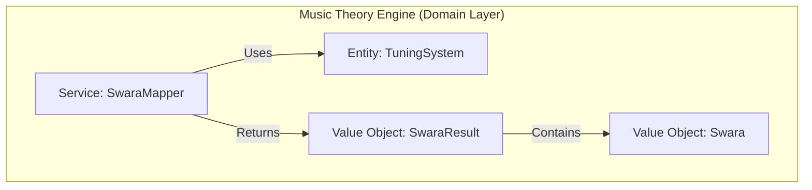
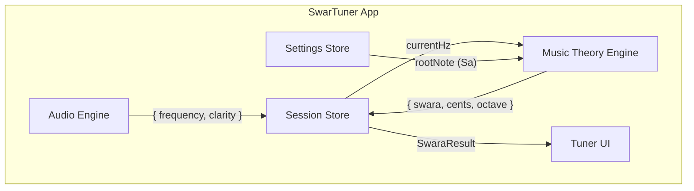

# Music Theory Engine - High-Level Design (HLD)

> **Module:** Music Theory Engine  
> **Version:** 1.0  
> **Date:** February 6, 2026  
> **Parent:** [System Architecture Overview](file:///f:/Development/SwarTuner/documents/architecture/OVERVIEW.md)

---

## 1. Module Overview

### 1.1 Purpose
The Music Theory Engine is the **brain** of SwarTuner. It takes a raw frequency (Hz) from the Audio Engine and translates it into musically meaningful information: the **Swara** name, the **deviation in cents**, and the **octave (Saptak)**.

### 1.2 Scope
*   Mapping frequency to One of 12 Swaras using **Just Intonation**.
*   Calculating cents deviation from the target Swara.
*   Determining the octave (Mandra, Madhya, Taar).
*   Managing the configurable Root Note ("Sa").

### 1.3 Out of Scope
*   Audio capture and pitch detection (handled by Audio Engine).
*   UI rendering.
*   Raga recognition or melodic analysis (Phase 1).

---

## 2. Architectural Pattern: Domain-Driven Design (DDD)

The Music Theory Engine is designed using **Domain-Driven Design** principles. It encapsulates the core business logic of Indian music theory within well-defined domain entities and value objects.

**Why DDD?**
*   **Rich Domain Model:** Indian music theory has specific rules and vocabulary that are best expressed as domain objects.
*   **Testability:** Pure domain logic with no external dependencies is trivial to unit test.
*   **Extensibility:** Adding support for other tuning systems (e.g., Equal Temperament for comparison) is straightforward.

---

## 3. Context Diagram

---

## 4. Key Components

| Component | Type | Responsibility |
| :--- | :--- | :--- |
| `Swara` | Value Object | Represents a single note with its name (e.g., "Komal Ga") and its Just Intonation ratio. |
| `TuningSystem` | Entity | Holds the complete set of 12 Swaras with their ratios. Calculates target frequencies based on the root note. |
| `SwaraMapper` | Domain Service | The core service. Given an input frequency and the root note, it returns the nearest `Swara`, deviation in `cents`, and `octave`. |
| `SwaraResult` | Value Object | The output data structure: `{ swara: Swara, cents: number, octave: Octave }`. |

---

## 5. Data Flow

1.  **Input:** `SwaraMapper` receives `inputHz` (from Session Store) and `rootNoteHz` (from Settings Store).
2.  **Octave Detection:** Normalize `inputHz` to the base octave by halving/doubling until it falls within the range `[rootNoteHz, 2 * rootNoteHz)`.
3.  **Swara Matching:** Iterate through the 12 Swaras, calculate the target frequency for each, and find the one with the smallest cents deviation.
4.  **Cents Calculation:** Calculate deviation: `cents = 1200 * log2(inputHz / targetHz)`.
5.  **Output:** Return `SwaraResult` containing the matched Swara, the calculated cents, and the detected octave.

---

## 6. Technology Choices

| Concern | Technology | Rationale |
| :--- | :--- | :--- |
| **Implementation** | Pure TypeScript | No external libraries needed. Domain logic is self-contained. |
| **Constants** | Immutable Objects | Swara definitions and ratios are defined as `readonly` constants. |

---

## 7. Non-Functional Requirements

| NFR | Target | Strategy |
| :--- | :--- | :--- |
| **Latency** | Negligible (< 1ms) | All calculations are simple arithmetic. No I/O. |
| **Accuracy** | Cents calculation within ±0.1 cents | Use `Math.log2` for precision. |
| **Correctness** | Must use Just Intonation ratios | Ratios are hardcoded from authoritative Indian music theory sources. |

---

## 8. Related Documents

*   [Music Theory Engine LLD](file:///f:/Development/SwarTuner/documents/architecture/music-theory-engine/LLD.md)
*   [Audio Engine HLD](file:///f:/Development/SwarTuner/documents/architecture/audio-engine/HLD.md)
*   [User Stories - Epic 3 (Indian Music Theory Logic)](file:///f:/Development/SwarTuner/documents/USER_STORIES.md)
