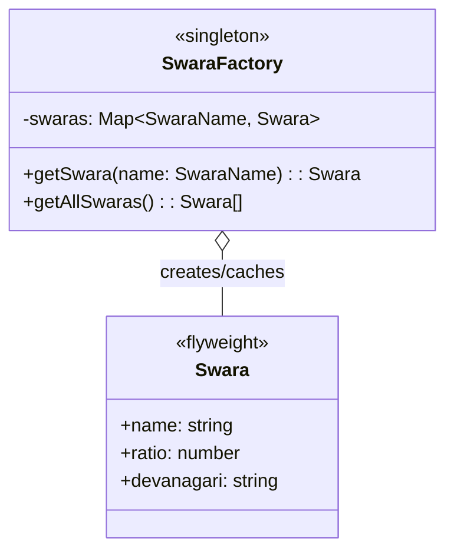
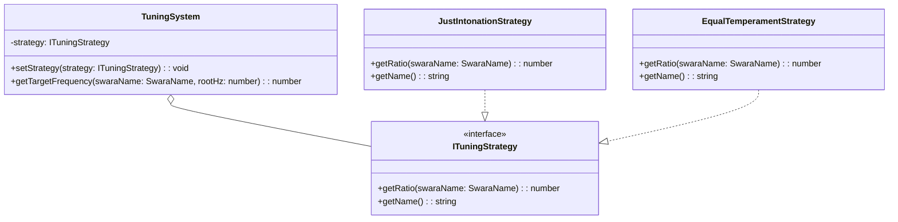

# Music Theory Engine - Low-Level Design (LLD)

> **Module:** Music Theory Engine  
> **Version:** 1.0  
> **Date:** February 6, 2026  
> **Parent:** [Music Theory Engine HLD](file:///f:/Development/SwarTuner/documents/architecture/music-theory-engine/HLD.md)

---

## 1. Introduction

This document provides the detailed Low-Level Design for the Music Theory Engine module, including class structures, interfaces, design patterns, and the core algorithms for Just Intonation mapping.

---

## 2. Design Patterns

### 2.1 Flyweight Pattern (Swara Constants)
The 12 Swaras and their ratios are **immutable, shared objects**. They are created once and reused throughout the application, minimizing memory footprint.



### 2.2 Strategy Pattern (Tuning System)
While Just Intonation is the primary tuning, the system is designed to be extensible. A `TuningStrategy` interface allows for alternative tunings.



---

## 3. Interfaces & Types

### 3.1 `SwaraName` Enum

```typescript
/**
 * [WHAT]: Enumerates all 12 Swaras of the Indian octave.
 * [WHY]: Type-safe identifiers for Swara lookup.
 */
enum SwaraName {
  SA = 'Sa',
  RE_KOMAL = 'Re (Komal)',
  RE_SHUDDH = 'Re (Shuddh)',
  GA_KOMAL = 'Ga (Komal)',
  GA_SHUDDH = 'Ga (Shuddh)',
  MA_SHUDDH = 'Ma (Shuddh)',
  MA_TEEVRA = 'Ma (Teevra)',
  PA = 'Pa',
  DHA_KOMAL = 'Dha (Komal)',
  DHA_SHUDDH = 'Dha (Shuddh)',
  NI_KOMAL = 'Ni (Komal)',
  NI_SHUDDH = 'Ni (Shuddh)',
}
```

### 3.2 `Octave` Enum

```typescript
/**
 * [WHAT]: Represents the three octaves (Saptaks) in Indian music.
 * [WHY]: Allows the UI to display the octave context.
 */
enum Octave {
  MANDRA = 'Mandra', // Lower
  MADHYA = 'Madhya', // Middle
  TAAR = 'Taar',     // Higher
}
```

### 3.3 `Swara` Value Object

```typescript
/**
 * [WHAT]: An immutable representation of a single Swara (note).
 * [WHY]: Core domain object for frequency mapping.
 */
interface Swara {
  /** The display name, e.g., "Komal Ga" */
  readonly name: SwaraName;

  /** Just Intonation ratio relative to Sa (1.0) */
  readonly ratio: number;

  /** Devanagari representation, e.g., "ग॒" */
  readonly devanagari: string;

  /** Short abbreviation for compact UI, e.g., "gₖ" */
  readonly abbreviation: string;
}
```

### 3.4 `SwaraResult` Value Object

```typescript
/**
 * [WHAT]: The output of the SwaraMapper.
 * [WHY]: Clean data transfer to the UI layer.
 */
interface SwaraResult {
  /** The identified Swara. Null if confidence is too low. */
  swara: Swara | null;

  /** The two closest Swaras when input is ambiguous. */
  candidates: [Swara, Swara] | null;

  /** Deviation from target in cents. Positive = sharp, Negative = flat. */
  cents: number;

  /** The detected octave. */
  octave: Octave;

  /** The target frequency for the identified Swara. */
  targetHz: number;

  /** Is the input ambiguous (between two notes)? */
  isAmbiguous: boolean;
}
```

---

## 4. Just Intonation Ratios

These ratios are defined per **US-3.2** from the User Stories.

```typescript
/**
 * [WHAT]: Canonical Just Intonation ratios for the 12 Swaras.
 * [WHY]: These are the mathematically pure intervals used in Indian Classical Music.
 */
const JUST_INTONATION_RATIOS: Readonly<Record<SwaraName, number>> = {
  [SwaraName.SA]:         1,        // 1:1 Unison
  [SwaraName.RE_KOMAL]:   16 / 15,  // Minor Second
  [SwaraName.RE_SHUDDH]:  9 / 8,    // Major Second
  [SwaraName.GA_KOMAL]:   6 / 5,    // Minor Third
  [SwaraName.GA_SHUDDH]:  5 / 4,    // Major Third
  [SwaraName.MA_SHUDDH]:  4 / 3,    // Perfect Fourth
  [SwaraName.MA_TEEVRA]:  45 / 32,  // Augmented Fourth (Tritone variant)
  [SwaraName.PA]:         3 / 2,    // Perfect Fifth
  [SwaraName.DHA_KOMAL]:  8 / 5,    // Minor Sixth
  [SwaraName.DHA_SHUDDH]: 5 / 3,    // Major Sixth
  [SwaraName.NI_KOMAL]:   9 / 5,    // Minor Seventh
  [SwaraName.NI_SHUDDH]:  15 / 8,   // Major Seventh
} as const;
```

---

## 5. Core Algorithm: `SwaraMapper`

### 5.1 Class Definition

```typescript
/**
 * [WHAT]: Maps a raw frequency to a Swara, cents deviation, and octave.
 * [WHY]: Core domain service encapsulating music theory logic.
 */
class SwaraMapper {
  private tuningSystem: TuningSystem;
  
  // [WHAT]: Threshold in cents to consider a note "ambiguous" between two Swaras.
  // [WHY]: Prevents forcing a choice when the user is genuinely between notes (US-4.2).
  private static readonly AMBIGUITY_THRESHOLD_CENTS = 15;

  constructor(tuningSystem: TuningSystem) {
    this.tuningSystem = tuningSystem;
  }

  /**
   * [WHAT]: Main entry point. Given input Hz and root Hz, returns the SwaraResult.
   * @param inputHz - The detected frequency from the Audio Engine.
   * @param rootHz - The user's configured Sa frequency.
   */
  public map(inputHz: number, rootHz: number): SwaraResult {
    // Step 1: Determine Octave
    const { normalizedHz, octave } = this.normalizeToBaseOctave(inputHz, rootHz);

    // Step 2: Find nearest Swara
    const { swara, cents, targetHz, secondClosest } = this.findNearestSwara(normalizedHz, rootHz);

    // Step 3: Check for ambiguity
    const isAmbiguous = Math.abs(cents) < SwaraMapper.AMBIGUITY_THRESHOLD_CENTS &&
                        secondClosest !== null &&
                        Math.abs(this.calculateCents(normalizedHz, this.tuningSystem.getTargetFrequency(secondClosest.name, rootHz))) < SwaraMapper.AMBIGUITY_THRESHOLD_CENTS;

    return {
      swara: isAmbiguous ? null : swara,
      candidates: isAmbiguous ? [swara, secondClosest!] : null,
      cents,
      octave,
      targetHz,
      isAmbiguous,
    };
  }

  // ... (private helper methods below)
}
```

### 5.2 Algorithm Steps (Pseudocode)

```
function map(inputHz, rootHz):
  // --- Step 1: Normalize to Base Octave ---
  // [WHAT]: Shift inputHz to the "middle" octave range [rootHz, 2*rootHz).
  // [WHY]: Simplifies comparison; we can then determine the octave separately.
  normalizedHz = inputHz
  octaveShift = 0
  while normalizedHz < rootHz:
    normalizedHz = normalizedHz * 2
    octaveShift = octaveShift - 1
  while normalizedHz >= rootHz * 2:
    normalizedHz = normalizedHz / 2
    octaveShift = octaveShift + 1
  octave = determineOctave(octaveShift)

  // --- Step 2: Find Nearest Swara ---
  // [WHAT]: Iterate through all 12 Swaras, calculate target Hz for each, find min cents deviation.
  // [WHY]: Just Intonation ratios give us exact target frequencies.
  bestSwara = null
  minCents = Infinity
  secondBestSwara = null
  secondMinCents = Infinity

  for each swaraName in SwaraName:
    targetHz = rootHz * JUST_INTONATION_RATIOS[swaraName]
    cents = 1200 * log2(normalizedHz / targetHz)
    absCents = abs(cents)

    if absCents < abs(minCents):
      secondBestSwara = bestSwara
      secondMinCents = minCents
      bestSwara = getSwaraObject(swaraName)
      minCents = cents
    else if absCents < abs(secondMinCents):
      secondBestSwara = getSwaraObject(swaraName)
      secondMinCents = cents

  // --- Step 3: Check Ambiguity ---
  // [WHAT]: If input is very close to TWO notes, mark as ambiguous.
  // [WHY]: Prevents forcing a wrong guess (US-4.2).
  isAmbiguous = abs(minCents) <= AMBIGUITY_THRESHOLD AND abs(secondMinCents) <= AMBIGUITY_THRESHOLD

  return SwaraResult(bestSwara, secondBestSwara, minCents, octave, isAmbiguous)
```

### 5.3 Cents Calculation Formula

$$
cents = 1200 \times \log_2 \left( \frac{f_{input}}{f_{target}} \right)
$$

*   **Positive cents:** Input is **sharp** (higher than target).
*   **Negative cents:** Input is **flat** (lower than target).
*   **Zero cents:** Input is **perfect**.

---

## 6. State Management

The Music Theory Engine is **stateless**. It is a pure function that takes input (Hz, rootHz) and returns output (`SwaraResult`). All state (current Hz, rootHz) is managed by the Zustand stores.

---

## 7. Error Handling

| Error Condition | Handling Strategy |
| :--- | :--- |
| `inputHz` is 0 or NaN | Return a "silent" `SwaraResult` with `swara: null`, `cents: 0`. |
| `rootHz` is invalid | This should be caught at the Settings layer. Default to 261.63 Hz (C4). |

---

## 8. Testing Strategy

### 8.1 Unit Tests
| Test Case | Input | Expected Output |
| :--- | :--- | :--- |
| Sa (Perfect) | `rootHz=261.63, inputHz=261.63` | `swara='Sa', cents=0` |
| Pa (Perfect) | `rootHz=261.63, inputHz=392.44` (1.5 ratio) | `swara='Pa', cents≈0` |
| Sharp Ga | `rootHz=261.63, inputHz=335` | `swara='Ga (Shuddh)', cents > 0` |
| Ambiguous | `rootHz=261.63, inputHz` between Komal Ga and Shuddh Ga | `isAmbiguous=true`, `candidates=[Komal Ga, Shuddh Ga]` |
| Octave Up (Taar) | `rootHz=261.63, inputHz=523.26` (Sa one octave up) | `swara='Sa', octave='Taar'` |

### 8.2 Integration Tests
*   Verify that the output from `SwaraMapper` correctly drives the UI to show expected Swara names and needle positions.

---

## 9. File Structure

```
src/
└── engine/
    └── theory/
        ├── index.ts                  # Public exports
        ├── SwaraMapper.ts            # Core service
        ├── TuningSystem.ts           # Manages tuning strategy
        ├── types.ts                  # Swara, SwaraResult, Octave, SwaraName
        ├── constants/
        │   └── justIntonation.ts     # JUST_INTONATION_RATIOS
        └── strategies/
            ├── ITuningStrategy.ts    # Interface
            ├── JustIntonationStrategy.ts
            └── EqualTemperamentStrategy.ts # (Optional, for future)
```

---

## 10. Related Documents

*   [Music Theory Engine HLD](file:///f:/Development/SwarTuner/documents/architecture/music-theory-engine/HLD.md)
*   [Audio Engine LLD](file:///f:/Development/SwarTuner/documents/architecture/audio-engine/LLD.md)
*   [User Stories - US-3.2 (Just Intonation)](file:///f:/Development/SwarTuner/documents/USER_STORIES.md)
