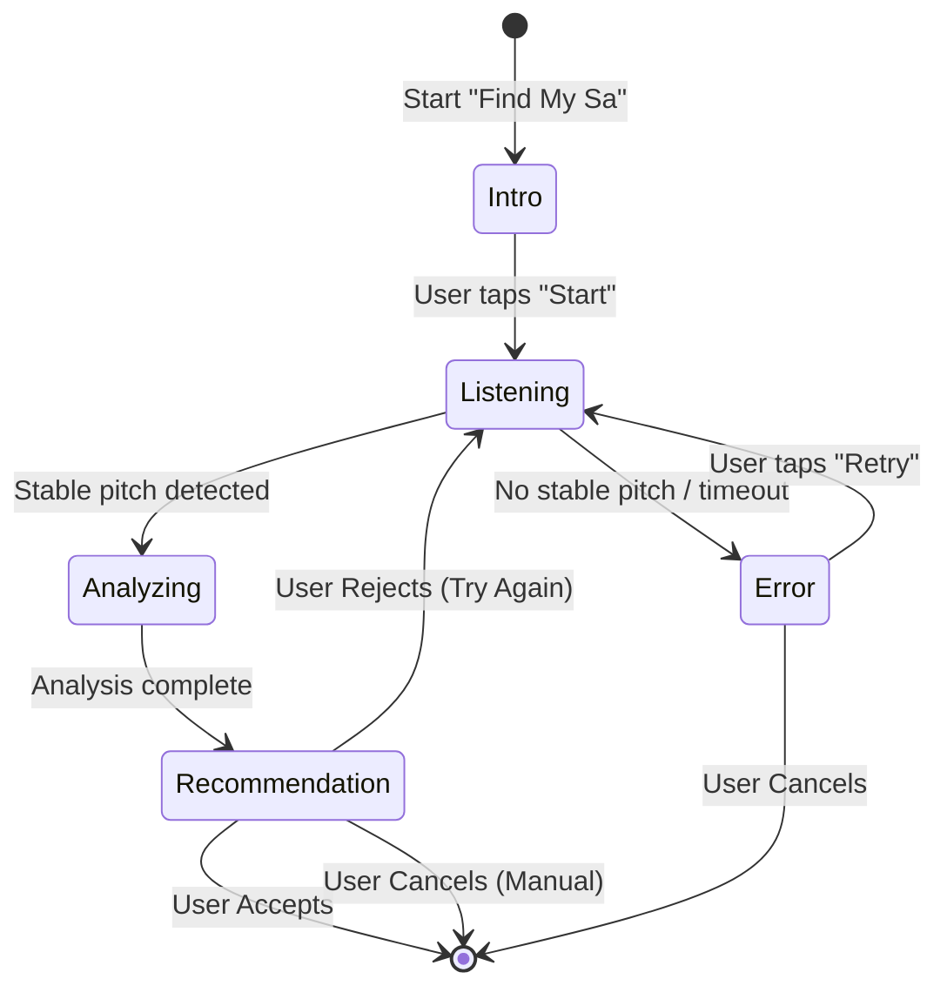
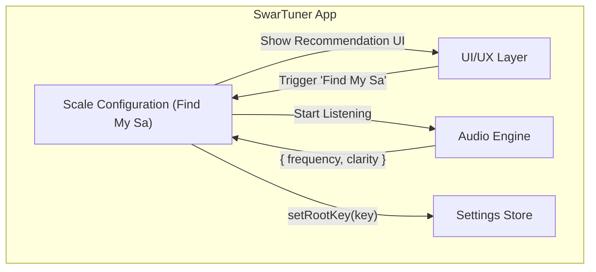

# Scale Configuration - High-Level Design (HLD)

> **Module:** Scale Configuration  
> **Version:** 1.0  
> **Date:** February 6, 2026  
> **Parent:** [System Architecture Overview](file:///f:/Development/SwarTuner/documents/architecture/OVERVIEW.md)

---

## 1. Module Overview

### 1.1 Purpose
The Scale Configuration module enables users to set their **Root Note (Sa)**. This is a critical initial step because all Swaras are relative to Sa. It provides both **manual selection** (for experienced users) and an **automated "Find My Sa"** wizard (for beginners).

### 1.2 Scope
*   Manual Root Note selection via a picker UI.
*   Automated "Find My Sa" guided flow:
    *   Prompting the user to sing.
    *   Analyzing their pitch.
    *   Recommending a Root Note.
*   Persisting the selected Root Note.

### 1.3 Out of Scope
*   Pitch detection algorithm (uses Audio Engine).
*   Swara calculation (uses Music Theory Engine).

---

## 2. Architectural Pattern: Wizard/Stepper Pattern

The "Find My Sa" feature is implemented as a **Wizard (Stepper) Pattern**, guiding the user through a multi-step process with clear forward progression.

**Why Wizard Pattern?**
*   **User Guidance:** Beginners need step-by-step instructions.
*   **Error Recovery:** Each step handles its own errors and allows retry.
*   **Clarity:** The flow is linear and predictable.

---

## 3. Context Diagram

---

## 4. Key Components

| Component | Type | Responsibility |
| :--- | :--- | :--- |
| `FindMySaScreen` | Screen | The main wizard UI. Manages the stepper state. |
| `FindMySaController` | Service/Hook | Orchestrates the detection logic. Interfaces with Audio Engine and Settings Store. |
| `PitchAverager` | Utility | Collects pitch samples over a duration and computes the average stable frequency. |
| `KeyRecommender` | Utility | Maps an average Hz to the nearest standard key (C, C#, D...). |

---

## 5. User Flow

1.  **Entry:** User navigates to Settings and taps "Find My Sa".
2.  **Intro Step:** Screen displays instructions: "Sing a comfortable, sustained note."
3.  **Listening Step:**
    *   User taps "Start Listening".
    *   Audio Engine begins capturing pitch.
    *   `PitchAverager` collects samples for 3 seconds.
    *   UI shows a listening animation.
4.  **Analysis Step:**
    *   If stable pitch detected, `KeyRecommender` determines the nearest key.
    *   If pitch is unstable/quiet, show Error step with retry option.
5.  **Recommendation Step:**
    *   UI displays: "You sang at ~147 Hz. We recommend: **D**".
    *   User can "Accept" (saves key, closes wizard) or "Try Again" (goes back to Listening).
6.  **Completion:** Root Note is saved to `useSettingsStore`. User is returned to Settings.

---

## 6. Technology Choices

| Concern | Technology | Rationale |
| :--- | :--- | :--- |
| **State Machine** | `useReducer` or XState (optional) | Manages the wizard's step transitions cleanly. `useReducer` is sufficient for Phase 1. |
| **Audio Engine Integration** | Hook (`useAudioPitch`) | Abstracts subscription to Audio Engine output. |
| **Averaging Logic** | Pure TypeScript | Simple math; no external libraries needed. |

---

## 7. Non-Functional Requirements

| NFR | Target | Strategy |
| :--- | :--- | :--- |
| **User Feedback Clarity** | Messages are easy to understand | Use plain language: "Sing a comfortable note", not "Provide vocal input". |
| **Error Recovery** | User can always retry or cancel | Every error state has a "Retry" and "Cancel" button. |
| **Latency** | Recommendation appears < 1 second after listening ends | Analysis is purely computational (fast). |

---

## 8. Related Documents

*   [Scale Configuration LLD](file:///f:/Development/SwarTuner/documents/architecture/scale-configuration/LLD.md)
*   [Audio Engine HLD](file:///f:/Development/SwarTuner/documents/architecture/audio-engine/HLD.md)
*   [User Stories - US-1.2 (Find My Sa)](file:///f:/Development/SwarTuner/documents/USER_STORIES.md)
