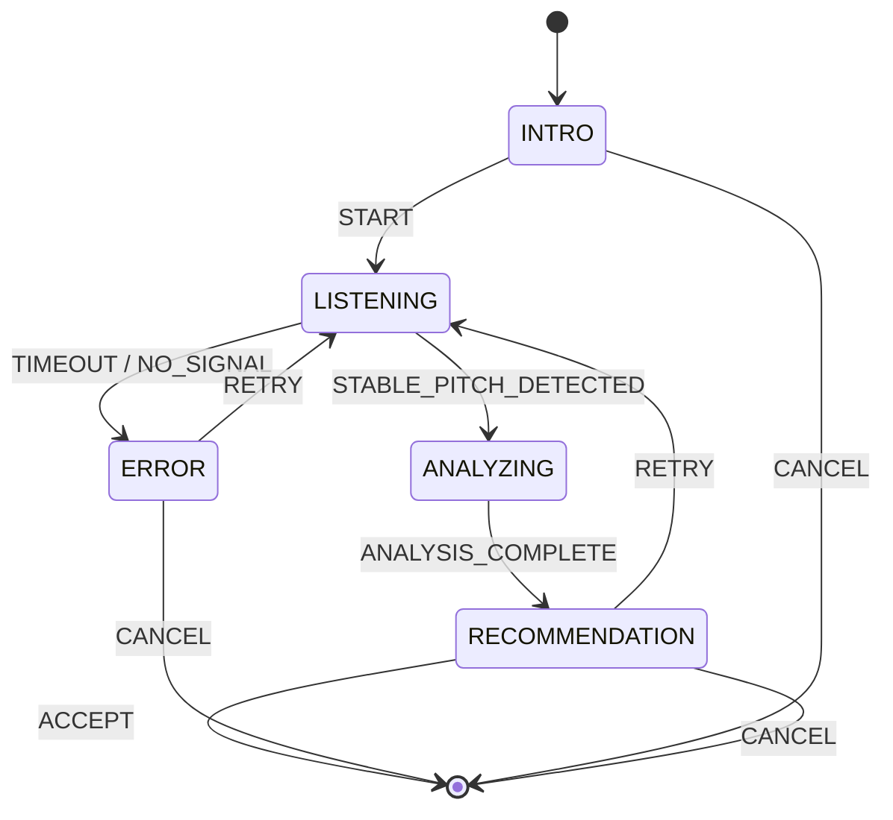

# Scale Configuration - Low-Level Design (LLD)

> **Module:** Scale Configuration  
> **Version:** 1.0  
> **Date:** February 6, 2026  
> **Parent:** [Scale Configuration HLD](file:///f:/Development/SwarTuner/documents/architecture/scale-configuration/HLD.md)

---

## 1. Introduction

This document provides the detailed Low-Level Design for the Scale Configuration module, including the state machine, utility classes, and the "Find My Sa" wizard implementation.

---

## 2. Design Patterns

### 2.1 State Machine Pattern (Wizard Steps)
The "Find My Sa" wizard is modeled as a finite state machine using React's `useReducer`. This ensures predictable state transitions and simplifies debugging.

**States:**

| State | Description |
| :--- | :--- |
| `INTRO` | Initial screen with instructions. |
| `LISTENING` | Audio Engine is active, collecting pitch samples. |
| `ANALYZING` | Processing collected samples; brief loading state. |
| `RECOMMENDATION` | Displaying the suggested key. |
| `ERROR` | An error occurred (e.g., no stable pitch). |

**Transitions:**



### 2.2 Reducer Implementation

```typescript
type WizardState = 'INTRO' | 'LISTENING' | 'ANALYZING' | 'RECOMMENDATION' | 'ERROR';

interface State {
  step: WizardState;
  collectedSamples: number[];
  averageHz: number | null;
  recommendedKey: string | null;
  errorMessage: string | null;
}

type Action =
  | { type: 'START' }
  | { type: 'ADD_SAMPLE'; payload: number }
  | { type: 'STABLE_PITCH_DETECTED' }
  | { type: 'ANALYSIS_COMPLETE'; payload: { hz: number; key: string } }
  | { type: 'TIMEOUT' }
  | { type: 'NO_SIGNAL' }
  | { type: 'RETRY' }
  | { type: 'ACCEPT' }
  | { type: 'CANCEL' };

/**
 * [WHAT]: Reducer for the Find My Sa wizard state machine.
 * [WHY]: Centralized, predictable state management for the wizard flow.
 */
function findMySaReducer(state: State, action: Action): State {
  switch (action.type) {
    case 'START':
      return { ...state, step: 'LISTENING', collectedSamples: [], errorMessage: null };
    case 'ADD_SAMPLE':
      return { ...state, collectedSamples: [...state.collectedSamples, action.payload] };
    case 'STABLE_PITCH_DETECTED':
      return { ...state, step: 'ANALYZING' };
    case 'ANALYSIS_COMPLETE':
      return {
        ...state,
        step: 'RECOMMENDATION',
        averageHz: action.payload.hz,
        recommendedKey: action.payload.key,
      };
    case 'TIMEOUT':
      return { ...state, step: 'ERROR', errorMessage: 'We didn\'t detect a stable note. Please try again.' };
    case 'NO_SIGNAL':
      return { ...state, step: 'ERROR', errorMessage: 'No sound detected. Please sing louder or check your microphone.' };
    case 'RETRY':
      return { ...state, step: 'LISTENING', collectedSamples: [], errorMessage: null };
    case 'ACCEPT':
    case 'CANCEL':
      return { ...state, step: 'INTRO' }; // Reset for next use
    default:
      return state;
  }
}
```

---

## 3. Utility Classes

### 3.1 `PitchAverager`

```typescript
/**
 * [WHAT]: Collects pitch samples and computes a stable average.
 * [WHY]: User's voice may fluctuate; averaging provides a more reliable result.
 */
class PitchAverager {
  private samples: number[] = [];
  private minSamples: number = 20; // Approx 2 seconds at 10 samples/sec
  private clarityThreshold: number = 0.85;

  /**
   * [WHAT]: Adds a sample if it meets the clarity threshold.
   * [WHY]: Filters out noisy/unreliable pitch readings.
   */
  addSample(frequency: number, clarity: number): void {
    if (clarity >= this.clarityThreshold && frequency > 50 && frequency < 1000) {
      this.samples.push(frequency);
    }
  }

  /**
   * [WHAT]: Returns true if enough samples have been collected.
   * [WHY]: Signals when to stop listening and start analysis.
   */
  hasEnoughSamples(): boolean {
    return this.samples.length >= this.minSamples;
  }

  /**
   * [WHAT]: Computes the average frequency of collected samples.
   * [WHY]: Provides the best estimate of the user's sung pitch.
   */
  getAverage(): number {
    if (this.samples.length === 0) return 0;
    const sum = this.samples.reduce((a, b) => a + b, 0);
    return sum / this.samples.length;
  }

  /**
   * [WHAT]: Resets the averager for a new detection attempt.
   * [WHY]: Clean slate for retry.
   */
  reset(): void {
    this.samples = [];
  }
}
```

### 3.2 `KeyRecommender`

```typescript
/**
 * [WHAT]: Maps a frequency to the nearest standard Western key.
 * [WHY]: Provides a user-friendly recommendation for the Root Note.
 */
class KeyRecommender {
  private static readonly A4_HZ = 440;
  private static readonly KEYS = ['C', 'C#', 'D', 'D#', 'E', 'F', 'F#', 'G', 'G#', 'A', 'A#', 'B'];

  /**
   * [WHAT]: Recommends the nearest key for a given frequency.
   * [WHY]: Converts raw Hz to a musically meaningful note name.
   *
   * @param hz - The average frequency from PitchAverager.
   * @returns An object with the key name and its exact Hz.
   */
  static recommend(hz: number): { key: string; keyHz: number } {
    // [WHAT]: Calculate the number of semitones from A4.
    // [WHY]: Standard formula for equal temperament note identification.
    const semitonesFromA4 = 12 * Math.log2(hz / KeyRecommender.A4_HZ);
    const roundedSemitones = Math.round(semitonesFromA4);

    // [WHAT]: Normalize to a key index (0-11).
    // [WHY]: A4 is index 9 in our KEYS array.
    let keyIndex = (9 + roundedSemitones) % 12;
    if (keyIndex < 0) keyIndex += 12;

    const key = KeyRecommender.KEYS[keyIndex];
    const keyHz = KeyRecommender.A4_HZ * Math.pow(2, roundedSemitones / 12);

    return { key, keyHz: Math.round(keyHz * 100) / 100 };
  }
}
```

---

## 4. Controller Hook (`useFindMySa`)

```typescript
/**
 * [WHAT]: Custom hook that orchestrates the Find My Sa wizard logic.
 * [WHY]: Encapsulates state machine, audio subscription, and store updates.
 */
function useFindMySa() {
  const [state, dispatch] = useReducer(findMySaReducer, initialState);
  const averager = useRef(new PitchAverager()).current;
  const { setRootKey } = useSettingsStore();
  const { subscribe, start, stop } = useAudioInput(); // Custom hook for Audio Engine

  // [WHAT]: Start listening when the user taps "Start".
  const startListening = useCallback(async () => {
    dispatch({ type: 'START' });
    averager.reset();
    await start();
  }, [start, averager]);

  // [WHAT]: Subscribe to pitch results from the Audio Engine.
  useEffect(() => {
    if (state.step !== 'LISTENING') return;

    const unsubscribe = subscribe((result: PitchResult) => {
      averager.addSample(result.frequency, result.clarity);

      if (averager.hasEnoughSamples()) {
        stop();
        dispatch({ type: 'STABLE_PITCH_DETECTED' });
        
        // --- Analysis phase (synchronous) ---
        const avgHz = averager.getAverage();
        const recommendation = KeyRecommender.recommend(avgHz);
        dispatch({
          type: 'ANALYSIS_COMPLETE',
          payload: { hz: avgHz, key: recommendation.key },
        });
      }
    });

    // [WHAT]: Timeout if no stable pitch after 5 seconds.
    // [WHY]: Prevents infinite waiting.
    const timeout = setTimeout(() => {
      stop();
      dispatch({ type: 'TIMEOUT' });
    }, 5000);

    return () => {
      unsubscribe();
      clearTimeout(timeout);
    };
  }, [state.step, subscribe, stop, averager]);

  // [WHAT]: Handle "Accept" action.
  const accept = useCallback(() => {
    if (state.recommendedKey) {
      setRootKey(state.recommendedKey);
    }
    dispatch({ type: 'ACCEPT' });
  }, [state.recommendedKey, setRootKey]);

  const retry = useCallback(() => {
    dispatch({ type: 'RETRY' });
    startListening();
  }, [startListening]);

  const cancel = useCallback(() => {
    stop();
    dispatch({ type: 'CANCEL' });
  }, [stop]);

  return {
    step: state.step,
    averageHz: state.averageHz,
    recommendedKey: state.recommendedKey,
    errorMessage: state.errorMessage,
    startListening,
    accept,
    retry,
    cancel,
  };
}
```

---

## 5. Screen Component (`FindMySaScreen`)

```tsx
/**
 * [WHAT]: The UI for the Find My Sa wizard.
 * [WHY]: Renders different views based on the current wizard step.
 */
function FindMySaScreen() {
  const {
    step,
    averageHz,
    recommendedKey,
    errorMessage,
    startListening,
    accept,
    retry,
    cancel,
  } = useFindMySa();

  return (
    <GlassCard>
      {step === 'INTRO' && (
        <>
          <Text>Sing a comfortable, sustained note.</Text>
          <PillButton label="Start Listening" onPress={startListening} />
          <PillButton label="Cancel" variant="ghost" onPress={cancel} />
        </>
      )}

      {step === 'LISTENING' && (
        <>
          <ListeningAnimation />
          <Text>Listening...</Text>
        </>
      )}

      {step === 'ANALYZING' && (
        <ActivityIndicator />
      )}

      {step === 'RECOMMENDATION' && (
        <>
          <Text>You sang at ~{averageHz?.toFixed(0)} Hz.</Text>
          <Text style={{ fontSize: 32 }}>We recommend: {recommendedKey}</Text>
          <PillButton label="Accept" onPress={accept} />
          <PillButton label="Try Again" variant="secondary" onPress={retry} />
        </>
      )}

      {step === 'ERROR' && (
        <>
          <Text>{errorMessage}</Text>
          <PillButton label="Retry" onPress={retry} />
          <PillButton label="Cancel" variant="ghost" onPress={cancel} />
        </>
      )}
    </GlassCard>
  );
}
```

---

## 6. Error Handling

| Error Condition | Trigger | UI Response |
| :--- | :--- | :--- |
| Timeout (5 seconds) | No stable pitch detected in time | Show ERROR step: "We didn't detect a stable note." |
| No Signal | All samples below clarity threshold | Show ERROR step: "No sound detected." |
| Audio Engine Error | Permission denied / Hardware failure | Propagate to ERROR step with specific message. |

---

## 7. Testing Strategy

### 7.1 Unit Tests
*   **`PitchAverager`:** Test that it correctly averages samples and filters by clarity.
*   **`KeyRecommender`:** Test with known frequencies (e.g., 440Hz -> "A", 261.63Hz -> "C").
*   **`findMySaReducer`:** Test all state transitions.

### 7.2 Integration Tests
*   Mock the Audio Engine to emit a sequence of pitch results.
*   Assert that the wizard progresses through LISTENING -> ANALYZING -> RECOMMENDATION.
*   Assert that "Accept" updates `useSettingsStore.rootKey`.

---

## 8. File Structure

```
src/
├── features/
│   └── scale-configuration/
│       ├── FindMySaScreen.tsx        # UI Component
│       ├── useFindMySa.ts            # Controller Hook
│       ├── findMySaReducer.ts        # State Machine
│       ├── PitchAverager.ts          # Utility Class
│       └── KeyRecommender.ts         # Utility Class
│
└── components/
    └── organisms/
        └── ListeningAnimation.tsx    # Animated listening indicator
```

---

## 9. Related Documents

*   [Scale Configuration HLD](file:///f:/Development/SwarTuner/documents/architecture/scale-configuration/HLD.md)
*   [Audio Engine LLD](file:///f:/Development/SwarTuner/documents/architecture/audio-engine/LLD.md)
*   [Storage & Settings LLD](file:///f:/Development/SwarTuner/documents/architecture/storage-settings/LLD.md)
