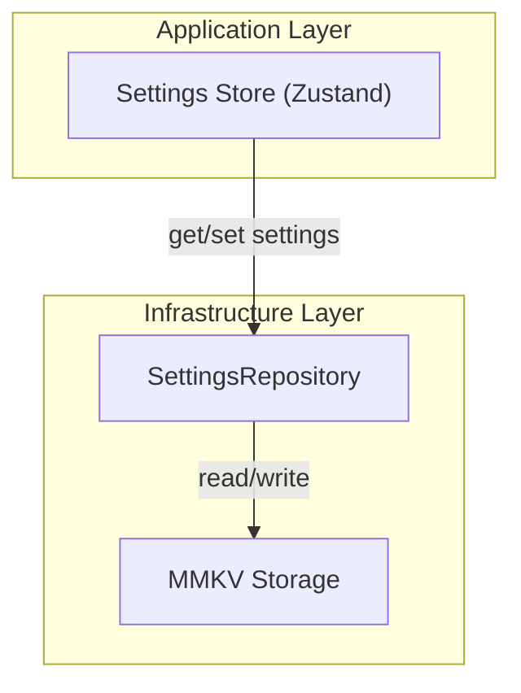
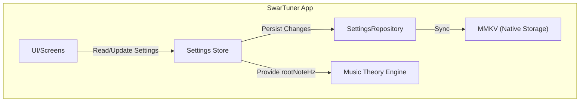

# Storage & Settings - High-Level Design (HLD)

> **Module:** Storage & Settings  
> **Version:** 1.0  
> **Date:** February 6, 2026  
> **Parent:** [System Architecture Overview](file:///f:/Development/SwarTuner/documents/architecture/OVERVIEW.md)

---

## 1. Module Overview

### 1.1 Purpose
The Storage & Settings module is the **persistence layer** of SwarTuner. It manages saving and retrieving user preferences, ensuring that settings like the Root Note (Sa), theme, and onboarding status are retained across app sessions.

### 1.2 Scope
*   Persisting user preferences (Root Note, Theme, Onboarding Completed).
*   Exposing global state (via Zustand) for reactive UI updates.
*   Providing a single source of truth for app-wide settings.

### 1.3 Out of Scope
*   Transient session data (current pitch, SwaraResult) – managed by a separate Session Store.
*   Cloud synchronization (Phase 1 is offline-only).
*   Secure storage (no sensitive data in Phase 1).

---

## 2. Architectural Pattern: Repository Pattern

The Storage & Settings module implements the **Repository Pattern**, abstracting the underlying storage mechanism (MMKV) from the rest of the application. This allows for easy swapping of storage backends (e.g., to AsyncStorage, SecureStore, or a remote API in the future) without affecting consumers.

**Why Repository Pattern?**
*   **Abstraction:** The UI/Stores interact with an abstract repository, not directly with MMKV.
*   **Testability:** The repository can be mocked in tests.
*   **Flexibility:** Storage backend can be changed without modifying the Store logic.

---

## 3. Context Diagram

---

## 4. Key Components

| Component | Type | Responsibility |
| :--- | :--- | :--- |
| `useSettingsStore` | Zustand Store | Global reactive state for settings. Exposes getters, setters, and actions. |
| `SettingsRepository` | Class | Abstracts MMKV read/write operations. Provides typed methods for each setting. |
| `IStorageAdapter` | Interface | Abstraction for the storage mechanism. MMKV is the concrete implementation. |

---

## 5. Data Schema

The following data is persisted:

| Key | Type | Default | Description |
| :--- | :--- | :--- | :--- |
| `rootKey` | `string` | `"C"` | The user's selected Root Note (Sa) in Western notation (e.g., "C#", "A"). |
| `theme` | `"dark" \| "light"` | `"dark"` | App color theme. |
| `onboardingComplete` | `boolean` | `false` | Whether the user has completed the "Find My Sa" onboarding. |
| `a4Frequency` | `number` | `440` | The reference frequency for A4 (for ultra-precise tuning). |

---

## 6. Data Flow

1.  **App Initialization:** On app start, `SettingsRepository` reads all persisted values from MMKV.
2.  **Store Hydration:** `useSettingsStore` is hydrated with the persisted values.
3.  **User Action:** User changes the Root Note in Settings screen.
4.  **Store Update:** `useSettingsStore.setRootKey('D')` is called.
5.  **Persistence:** The store's middleware calls `SettingsRepository.setRootKey('D')`, which writes to MMKV.
6.  **Reactivity:** The Music Theory Engine re-calculates target frequencies based on the new `rootNoteHz`.

---

## 7. Technology Choices

| Concern | Technology | Rationale |
| :--- | :--- | :--- |
| **State Management** | Zustand | Minimal boilerplate, excellent TypeScript support, easy middleware for persistence. |
| **Persistence** | react-native-mmkv | Fastest synchronous key-value storage for React Native. Essential for immediate UI updates on app launch. |

---

## 8. Non-Functional Requirements

| NFR | Target | Strategy |
| :--- | :--- | :--- |
| **Start-up Speed** | Settings loaded < 50ms | MMKV is synchronous and optimized for fast reads. |
| **Data Integrity** | No data corruption | MMKV is ACID-compliant and handles app crashes gracefully. |
| **Offline (NFR-3)** | Full offline support | All data is stored locally. No network calls. |

---

## 9. Related Documents

*   [Storage & Settings LLD](file:///f:/Development/SwarTuner/documents/architecture/storage-settings/LLD.md)
*   [Scale Configuration HLD](file:///f:/Development/SwarTuner/documents/architecture/scale-configuration/HLD.md)
*   [User Stories - US-1.1 (Persisted Root Note)](file:///f:/Development/SwarTuner/documents/USER_STORIES.md)
