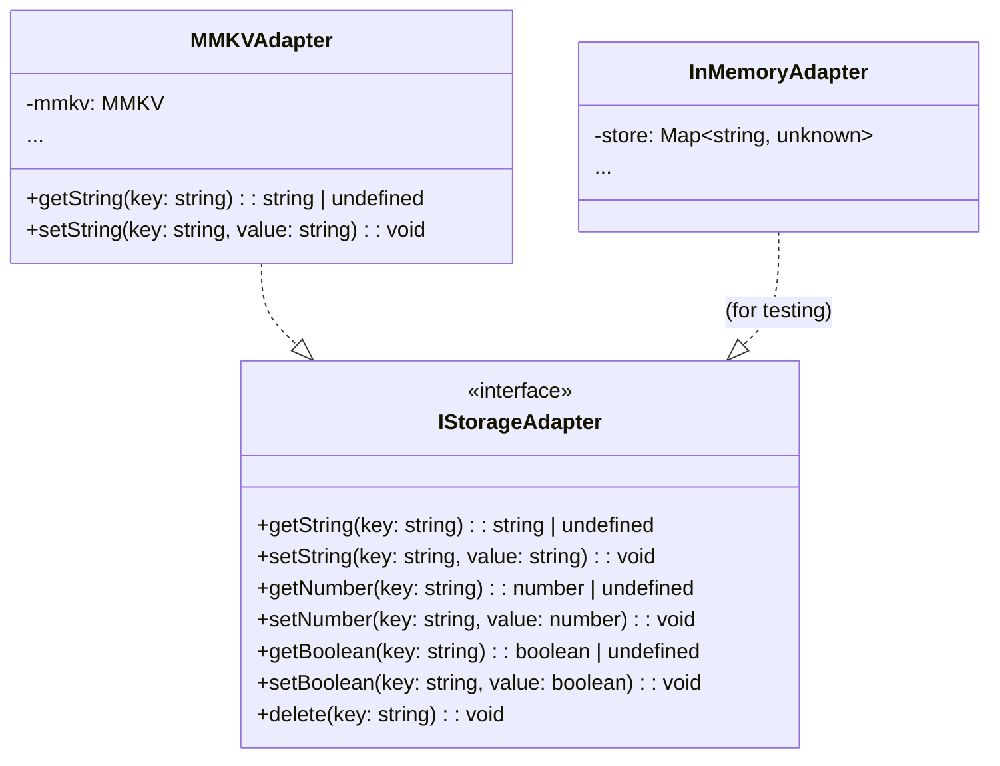
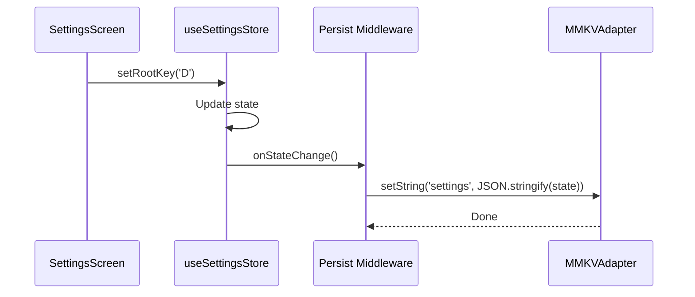

# Storage & Settings - Low-Level Design (LLD)

> **Module:** Storage & Settings  
> **Version:** 1.0  
> **Date:** February 6, 2026  
> **Parent:** [Storage & Settings HLD](file:///f:/Development/SwarTuner/documents/architecture/storage-settings/HLD.md)

---

## 1. Introduction

This document provides the detailed Low-Level Design for the Storage & Settings module, including class structures, interfaces, design patterns, and the Zustand store implementation.

---

## 2. Design Patterns

### 2.1 Adapter Pattern (Storage Abstraction)
An `IStorageAdapter` interface abstracts the underlying storage mechanism. `MMKVAdapter` is the concrete implementation. This allows for easy testing and future swapping of storage backends.



### 2.2 Singleton Pattern (MMKV Instance)
The MMKV storage instance is created once and shared across the application.

```typescript
// src/store/storage/mmkvAdapter.ts
import { MMKV } from 'react-native-mmkv';

/**
 * [WHAT]: Singleton MMKV instance for the entire app.
 * [WHY]: Avoid multiple instances; ensure consistent storage access.
 */
export const storage = new MMKV({
  id: 'swartuner-settings',
});
```

### 2.3 Zustand Persist Middleware
Zustand's `persist` middleware is used to automatically sync the store state with MMKV on every update.



---

## 3. Interfaces & Types

### 3.1 `IStorageAdapter` Interface

```typescript
/**
 * [WHAT]: Abstraction for key-value storage operations.
 * [WHY]: Enables dependency injection and mocking for tests.
 */
interface IStorageAdapter {
  getString(key: string): string | undefined;
  setString(key: string, value: string): void;
  getNumber(key: string): number | undefined;
  setNumber(key: string, value: number): void;
  getBoolean(key: string): boolean | undefined;
  setBoolean(key: string, value: boolean): void;
  delete(key: string): void;
  clearAll(): void;
}
```

### 3.2 `SettingsState` Type

```typescript
/**
 * [WHAT]: Shape of the persisted settings state.
 * [WHY]: Type-safe access to all settings.
 */
interface SettingsState {
  /** The user's Root Note (Sa) key, e.g., "C", "C#", "D". */
  rootKey: string;

  /** Calculated frequency of the Root Note in Hz. Derived from rootKey. */
  rootNoteHz: number;

  /** App color theme. */
  theme: 'dark' | 'light';

  /** Whether the user has completed onboarding. */
  onboardingComplete: boolean;

  /** Reference frequency for A4 (default 440). */
  a4Frequency: number;
}
```

### 3.3 `SettingsActions` Type

```typescript
/**
 * [WHAT]: Actions available on the Settings store.
 * [WHY]: Provides a clean API for modifying settings.
 */
interface SettingsActions {
  /** Sets the Root Note and recalculates rootNoteHz. */
  setRootKey: (key: string) => void;

  /** Sets the theme. */
  setTheme: (theme: 'dark' | 'light') => void;

  /** Marks onboarding as complete. */
  completeOnboarding: () => void;

  /** Resets all settings to defaults. */
  resetToDefaults: () => void;
}
```

---

## 4. Zustand Store Implementation

```typescript
// src/store/useSettingsStore.ts
import { create } from 'zustand';
import { persist, createJSONStorage } from 'zustand/middleware';
import { storage } from './storage/mmkvAdapter';
import { calculateRootNoteHz, DEFAULTS } from './utils';

/**
 * [WHAT]: Zustand custom storage adapter for MMKV.
 * [WHY]: Bridges Zustand's persist middleware with MMKV.
 */
const zustandMMKVStorage = createJSONStorage(() => ({
  getItem: (name: string) => storage.getString(name) ?? null,
  setItem: (name: string, value: string) => storage.setString(name, value),
  removeItem: (name: string) => storage.delete(name),
}));

/**
 * [WHAT]: The global Settings store.
 * [WHY]: Single source of truth for user preferences.
 */
export const useSettingsStore = create<SettingsState & SettingsActions>()(
  persist(
    (set, get) => ({
      // --- State ---
      rootKey: DEFAULTS.ROOT_KEY,
      rootNoteHz: calculateRootNoteHz(DEFAULTS.ROOT_KEY, DEFAULTS.A4_FREQUENCY),
      theme: DEFAULTS.THEME,
      onboardingComplete: false,
      a4Frequency: DEFAULTS.A4_FREQUENCY,

      // --- Actions ---
      /**
       * [WHAT]: Sets the root key and recalculates the root note frequency.
       * [WHY]: Ensures rootNoteHz is always in sync with rootKey.
       */
      setRootKey: (key: string) => {
        const newHz = calculateRootNoteHz(key, get().a4Frequency);
        set({ rootKey: key, rootNoteHz: newHz });
      },

      setTheme: (theme) => set({ theme }),

      completeOnboarding: () => set({ onboardingComplete: true }),

      resetToDefaults: () => set({
        rootKey: DEFAULTS.ROOT_KEY,
        rootNoteHz: calculateRootNoteHz(DEFAULTS.ROOT_KEY, DEFAULTS.A4_FREQUENCY),
        theme: DEFAULTS.THEME,
        onboardingComplete: false,
        a4Frequency: DEFAULTS.A4_FREQUENCY,
      }),
    }),
    {
      name: 'settings-storage', // MMKV key
      storage: zustandMMKVStorage,
    }
  )
);
```

---

## 5. Helper Functions

### 5.1 `calculateRootNoteHz`

```typescript
/**
 * [WHAT]: Calculates the frequency of any note given A4 frequency.
 * [WHY]: Converts user's selected key (e.g., "C#") to Hz for the Music Theory Engine.
 *
 * @param key - The note name (e.g., "C", "C#", "D").
 * @param a4Hz - The reference frequency for A4 (default 440).
 * @returns The frequency in Hz.
 */
function calculateRootNoteHz(key: string, a4Hz: number = 440): number {
  // [WHAT]: Semitone offset from A4 for each note.
  // [WHY]: Standard Western chromatic scale.
  const semitoneOffsets: Record<string, number> = {
    'C': -9, 'C#': -8, 'D': -7, 'D#': -6, 'E': -5, 'F': -4,
    'F#': -3, 'G': -2, 'G#': -1, 'A': 0, 'A#': 1, 'B': 2,
  };

  const offset = semitoneOffsets[key] ?? 0;
  // [WHAT]: Equal Temperament formula for frequency.
  // [WHY]: Standard formula, even though we use Just Intonation for Swaras,
  //        the ROOT note selection uses ET for compatibility with standard pitch pipes.
  return a4Hz * Math.pow(2, offset / 12);
}
```

---

## 6. Session Store (Transient Data)

Separate from `useSettingsStore`, a `useSessionStore` manages real-time tuner data. This is NOT persisted.

```typescript
// src/store/useSessionStore.ts
import { create } from 'zustand';
import { SwaraResult } from '@/engine/theory/types';

interface SessionState {
  swaraResult: SwaraResult | null;
  isListening: boolean;
}

interface SessionActions {
  setSwaraResult: (result: SwaraResult | null) => void;
  setListening: (listening: boolean) => void;
}

export const useSessionStore = create<SessionState & SessionActions>((set) => ({
  swaraResult: null,
  isListening: false,
  setSwaraResult: (result) => set({ swaraResult: result }),
  setListening: (listening) => set({ isListening: listening }),
}));
```

---

## 7. Error Handling

| Error Condition | Handling Strategy |
| :--- | :--- |
| MMKV initialization failure | Catch error during app boot, log, and fall back to `InMemoryAdapter`. Settings won't persist but app functions. |
| Corrupted data on read | Use Zustand's `onRehydrateStorage` to validate data. If invalid, reset to defaults. |
| Invalid `rootKey` received | `setRootKey` validates against known keys; ignores invalid input. |

---

## 8. Testing Strategy

### 8.1 Unit Tests
*   **`calculateRootNoteHz`:** Test with known values (e.g., "A" @ 440Hz = 440, "C" @ 440Hz ≈ 261.63).
*   **Store Actions:** Use `InMemoryAdapter` mock. Test that `setRootKey` updates both `rootKey` and `rootNoteHz`.

### 8.2 Integration Tests
*   Test that settings persist across app restarts (using Detox).

---

## 9. File Structure

```
src/
└── store/
    ├── index.ts                  # Re-exports all stores
    ├── useSettingsStore.ts       # Persisted settings
    ├── useSessionStore.ts        # Transient session data
    ├── storage/
    │   ├── IStorageAdapter.ts    # Interface
    │   ├── mmkvAdapter.ts        # MMKV implementation
    │   └── inMemoryAdapter.ts    # Mock for testing
    └── utils/
        ├── calculateRootNoteHz.ts
        └── defaults.ts           # Default values
```

---

## 10. Related Documents

*   [Storage & Settings HLD](file:///f:/Development/SwarTuner/documents/architecture/storage-settings/HLD.md)
*   [Music Theory Engine LLD](file:///f:/Development/SwarTuner/documents/architecture/music-theory-engine/LLD.md)
