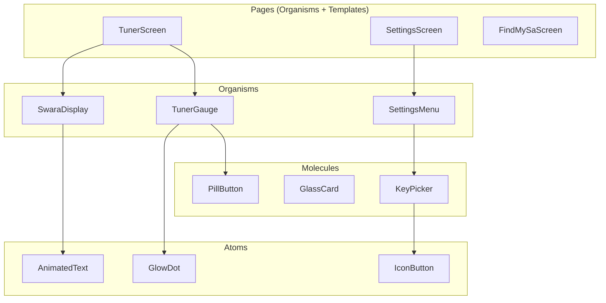
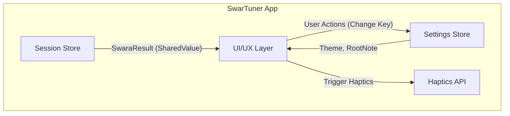

# UI/UX Layer - High-Level Design (HLD)

> **Module:** UI/UX Layer  
> **Version:** 1.0  
> **Date:** February 6, 2026  
> **Parent:** [System Architecture Overview](file:///f:/Development/SwarTuner/documents/architecture/OVERVIEW.md)

---

## 1. Module Overview

### 1.1 Purpose
The UI/UX Layer is the **face** of SwarTuner. It is responsible for rendering all visual elements, handling user interactions, and providing a fluid, responsive experience that adheres to the "Fluid Minimalism & Artistic Resonance" design system.

### 1.2 Scope
*   All React Native screens (Tuner, Settings, Onboarding).
*   Reusable UI components (Buttons, Cards, Modals).
*   High-performance animations (Tuner Gauge, Needle).
*   Haptic feedback integration.
*   Responsive layout for phones and tablets.

### 1.3 Out of Scope
*   Audio processing logic (handled by Audio Engine).
*   Music theory calculations (handled by Music Theory Engine).
*   Data persistence (handled by Storage & Settings).

---

## 2. Architectural Pattern: Component-Based Architecture (Atomic Design)

The UI is structured using **Atomic Design** principles, organizing components from the smallest (Atoms) to the largest (Templates/Pages).

**Why Atomic Design?**
*   **Reusability:** Small, composable units reduce code duplication.
*   **Consistency:** Ensures a unified look and feel across the app.
*   **Testability:** Atoms and Molecules can be tested in isolation (Storybook).

---

## 3. Context Diagram

---

## 4. Key Screens & Components

### 4.1 Screens

| Screen | Responsibility | Key Components |
| :--- | :--- | :--- |
| **TunerScreen** | Main view. Displays the real-time pitch feedback. | `TunerGauge`, `SwaraDisplay`, `OctaveIndicator` |
| **SettingsScreen** | User configuration. | `KeyPicker`, `ThemeToggle`, `FindMySaButton` |
| **FindMySaScreen** | Guided wizard for detecting user's natural scale. | `InstructionText`, `ListeningIndicator`, `ConfirmationModal` |

### 4.2 Core Components

| Component | Type | Responsibility |
| :--- | :--- | :--- |
| `TunerGauge` | Organism | The main dial displaying pitch deviation. Animated needle driven by `cents` SharedValue. |
| `SwaraDisplay` | Organism | Displays the current Swara name (e.g., "Komal Ga") and octave. |
| `GlassCard` | Molecule | A reusable card with glassmorphism effect (blur, subtle border). |
| `PillButton` | Molecule | Rounded, animated button with haptic feedback on press. |
| `AnimatedText` | Atom | Text component with entry/exit animations. |

---

## 5. Data Flow

1.  **Session Store Update:** The Music Theory Engine updates the `SwaraResult` in the Session Store.
2.  **SharedValue Sync:** The `cents` value is synced to a Reanimated `SharedValue` (on the UI thread).
3.  **Gauge Animation:** `TunerGauge` uses `useDerivedValue` to interpolate the needle's rotation and color based on `cents`.
4.  **Text Update:** `SwaraDisplay` reads `swara.name` and `octave` from the store and updates the text (JS thread, but infrequent).
5.  **User Interaction:** User presses a button -> `onPressIn` triggers scale animation -> `onPressOut` restores scale -> Action is dispatched.

---

## 6. Technology Choices

| Concern | Technology | Rationale |
| :--- | :--- | :--- |
| **Styling** | NativeWind (Tailwind CSS) | Utility-first CSS for rapid, consistent styling. Adheres to design tokens from UI/UX Guidelines. |
| **Animations** | React Native Reanimated 3 | Essential for 60fps UI-thread animations on the Tuner Gauge. |
| **Blur Effects** | expo-blur | Native-quality glassmorphism. |
| **Haptics** | expo-haptics | Consistent haptic feedback across iOS and Android. |
| **Navigation** | Expo Router (File-based) | Simple, declarative routing. |

---

## 7. Non-Functional Requirements

| NFR | Target | Strategy |
| :--- | :--- | :--- |
| **Frame Rate** | 60fps for Gauge animation | All needle movement uses Reanimated SharedValues; no JS bridge crossing. |
| **Responsiveness (NFR-4)** | Adapt to 5" - 12" screens | Use NativeWind responsive modifiers (`md:`, `lg:`), `useSafeAreaInsets`. |
| **Accessibility** | Touch targets ≥ 44x44pt | All buttons and interactive elements are sized appropriately. |
| **Visual Simplicity (UX-1)** | Clean, focused UI | Single focal point (Gauge). No complex graphs or waveforms. |

---

## 8. Design System Integration

The UI/UX Layer strictly adheres to the [UI/UX Guidelines](file:///f:/Development/SwarTuner/documents/UI_UX_GUIDELINES.md).

| Guideline | Implementation |
| :--- | :--- |
| **No Hard Blacks** | Background color: `#080808`. |
| **Glassmorphism** | All cards use `expo-blur` with `intensity={25}`. |
| **Spring Animations** | `withSpring()` for all interactive state changes. |
| **Haptic Feedback** | `expo-haptics` on every button press. |
| **Floating Layouts** | Primary UI elements have `m-5` margin and do not touch screen edges. |

---

## 9. Related Documents

*   [UI/UX Layer LLD](file:///f:/Development/SwarTuner/documents/architecture/ui-ux-layer/LLD.md)
*   [UI/UX Guidelines](file:///f:/Development/SwarTuner/documents/UI_UX_GUIDELINES.md)
*   [User Stories - Epic 4 (UI & Experience)](file:///f:/Development/SwarTuner/documents/USER_STORIES.md)
