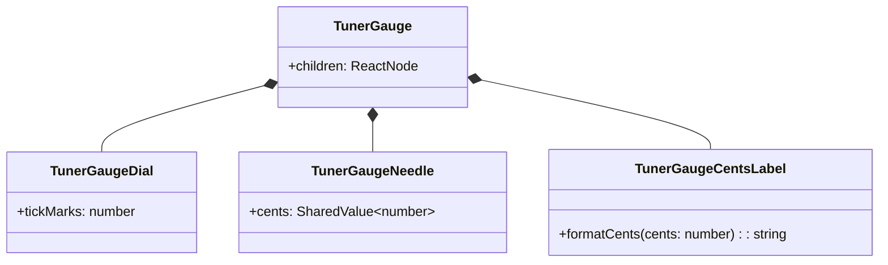
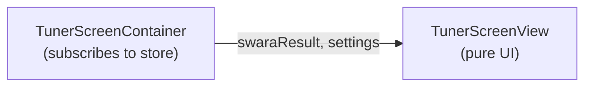
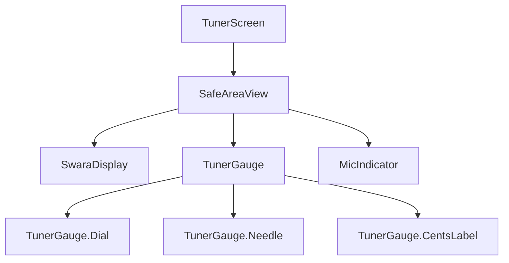

# UI/UX Layer - Low-Level Design (LLD)

> **Module:** UI/UX Layer  
> **Version:** 1.0  
> **Date:** February 6, 2026  
> **Parent:** [UI/UX Layer HLD](file:///f:/Development/SwarTuner/documents/architecture/ui-ux-layer/HLD.md)

---

## 1. Introduction

This document details the Low-Level Design for the UI/UX Layer, including component specifications, animation logic, design patterns, and testing strategies.

---

## 2. Design Patterns

### 2.1 Compound Component Pattern (TunerGauge)
The `TunerGauge` is a complex component composed of multiple sub-components. The Compound Component pattern provides a clean, declarative API while encapsulating internal logic.

```tsx
// Usage
<TunerGauge>
  <TunerGauge.Dial />
  <TunerGauge.Needle />
  <TunerGauge.CentsLabel />
</TunerGauge>
```



### 2.2 Presentational/Container Pattern
*   **Containers (Screens):** Handle data fetching/subscription from stores and pass data down as props.
*   **Presentational (Components):** Pure UI; no direct store access.



### 2.3 Custom Hook Pattern (Animations & State)
Reusable animation logic is extracted into custom hooks.

*   `usePressAnimation()`: Returns animated style for press feedback.
*   `useGaugeAnimation(cents)`: Returns animated style for needle rotation.

---

## 3. Component Specifications

### 3.1 `TunerGauge` Component

```typescript
/**
 * [WHAT]: The main pitch indicator dial.
 * [WHY]: Provides immediate, visual feedback on pitch accuracy.
 */
interface TunerGaugeProps {
  /** The current deviation in cents. Comes from a SharedValue. */
  cents: SharedValue<number>;

  /** The color to use for the "perfect" state (default: green). */
  perfectColor?: string;

  /** The color to use for the "off" state (default: red). */
  offColor?: string;
}
```

**Implementation Notes:**
*   Needle rotation: `rotate: interpolate(cents, [-50, 0, 50], [-45deg, 0, 45deg])`
*   Color interpolation: `interpolateColor(Math.abs(cents), [0, 25, 50], [green, yellow, red])`

### 3.2 `SwaraDisplay` Component

```typescript
/**
 * [WHAT]: Displays the identified Swara name and octave.
 * [WHY]: Primary feedback for note identification.
 */
interface SwaraDisplayProps {
  /** The Swara object to display. Null for ambiguous/silent state. */
  swara: Swara | null;

  /** The candidate swaras if ambiguous. */
  candidates: [Swara, Swara] | null;

  /** The current octave. */
  octave: Octave;

  /** Whether the input is ambiguous. */
  isAmbiguous: boolean;
}
```

**Display Logic:**
*   **Normal:** Display `swara.name` (e.g., "Komal Ga") with large font.
*   **Ambiguous:** Display `candidate[0].abbreviation ? / ? candidate[1].abbreviation` (e.g., "gₖ ? / G").
*   **Silent:** Display `"--"` or a faded "Listening..." text.

### 3.3 `PillButton` Component

```typescript
/**
 * [WHAT]: A rounded, animated button with haptic feedback.
 * [WHY]: Consistent interactive element across the app.
 */
interface PillButtonProps {
  label: string;
  onPress: () => void;
  variant?: 'primary' | 'secondary' | 'ghost';
  disabled?: boolean;
}
```

**Animation:**
*   `onPressIn`: `scale.value = withSpring(0.96)`
*   `onPressOut`: `scale.value = withSpring(1.0)`
*   Haptic: `Haptics.impactAsync(ImpactFeedbackStyle.Light)` on `onPressIn`.

---

## 4. Animation Specifications

### 4.1 Needle Animation (`useGaugeAnimation` Hook)

```typescript
/**
 * [WHAT]: Hook that provides animated styles for the TunerGauge needle.
 * [WHY]: Decouples animation logic from component rendering.
 */
function useGaugeAnimation(cents: SharedValue<number>) {
  // [WHAT]: Derive rotation angle from cents.
  // [WHY]: Maps [-50, 50] cents to [-45, 45] degrees.
  const rotation = useDerivedValue(() => {
    return interpolate(cents.value, [-50, 0, 50], [-45, 0, 45], Extrapolation.CLAMP);
  });

  // [WHAT]: Derive needle color from cents deviation.
  // [WHY]: Visual cue for how "off" the pitch is.
  const color = useDerivedValue(() => {
    const absCents = Math.abs(cents.value);
    // Perfect (green) -> Slight deviation (yellow) -> Significant (red)
    return interpolateColor(absCents, [0, 15, 40], ['#22C55E', '#FACC15', '#EF4444']);
  });

  const animatedStyle = useAnimatedStyle(() => ({
    transform: [{ rotate: `${rotation.value}deg` }],
    backgroundColor: color.value,
  }));

  return animatedStyle;
}
```

### 4.2 Press Animation (`usePressAnimation` Hook)

```typescript
/**
 * [WHAT]: Hook for scale-down/up press feedback.
 * [WHY]: Provides tactile "physicality" per UI/UX Guidelines.
 */
function usePressAnimation() {
  const scale = useSharedValue(1);

  const onPressIn = () => {
    scale.value = withSpring(0.96, { damping: 15, stiffness: 400 });
    Haptics.impactAsync(Haptics.ImpactFeedbackStyle.Light);
  };

  const onPressOut = () => {
    scale.value = withSpring(1.0, { damping: 15, stiffness: 400 });
  };

  const animatedStyle = useAnimatedStyle(() => ({
    transform: [{ scale: scale.value }],
  }));

  return { animatedStyle, onPressIn, onPressOut };
}
```

---

## 5. Screen Layouts

### 5.1 TunerScreen Layout

```
+--------------------------------------------------+
|  (Safe Area Top)                                 |
+--------------------------------------------------+
|                                                  |
|                   SWARA DISPLAY                  |
|                    "Komal Ga"                    |
|                     Madhya                       |
|                                                  |
+--------------------------------------------------+
|                                                  |
|               [  TUNER GAUGE  ]                  |
|                   (Needle)                       |
|                                                  |
|                   +12 cents                      |
|                                                  |
+--------------------------------------------------+
|          [ Microphone Active Indicator ]         |
+--------------------------------------------------+
|  (Safe Area Bottom / Floating Tab Bar)          |
+--------------------------------------------------+
```

### 5.2 Component Hierarchy (Mermaid)



---

## 6. State Management (UI-Specific)

The UI layer reads from two Zustand stores:

*   **`useSessionStore`:** Real-time tuner data (`swaraResult: SwaraResult`).
*   **`useSettingsStore`:** User preferences (`rootKey`, `theme`).

**Important:** The `cents` value for the `TunerGauge` is bridged to a Reanimated `SharedValue` to enable UI-thread animations without JS bridge overhead.

```typescript
// In TunerScreen container
const cents = useSharedValue(0);

// Subscribe to store and sync SharedValue
useEffect(() => {
  const unsubscribe = useSessionStore.subscribe(
    (state) => state.swaraResult?.cents ?? 0,
    (newCents) => {
      cents.value = newCents; // Direct update on UI thread
    }
  );
  return unsubscribe;
}, []);
```

---

## 7. Error Handling (UI)

| State | UI Behavior |
| :--- | :--- |
| Permission Denied | Navigate to `PermissionDeniedScreen` with a "Go to Settings" button. |
| Low Signal / Silence | `SwaraDisplay` shows "--", `TunerGauge` needle is "ghosted" (50% opacity, centered). |
| Hardware Error | Display a modal: "Microphone unavailable. Please restart the app." |

---

## 8. Testing Strategy

### 8.1 Unit Tests (Jest + React Native Testing Library)
*   Test that `SwaraDisplay` renders correct text for different `SwaraResult` inputs.
*   Test that `PillButton` calls `onPress` handler when pressed.

### 8.2 Snapshot Tests
*   Snapshot test for `GlassCard`, `PillButton`, and other Atoms/Molecules to prevent visual regressions.

### 8.3 E2E Tests (Detox / Maestro)
*   Navigate to TunerScreen, verify Gauge is visible.
*   Navigate to Settings, change key, verify change is persisted.

---

## 9. File Structure

```
src/
├── app/                        # Expo Router file-based routing
│   ├── (tabs)/
│   │   ├── index.tsx           # TunerScreen
│   │   └── settings.tsx        # SettingsScreen
│   ├── find-my-sa.tsx          # FindMySaScreen (Modal)
│   └── _layout.tsx             # Root layout with Tab Bar
│
├── components/
│   ├── atoms/
│   │   ├── AnimatedText.tsx
│   │   ├── IconButton.tsx
│   │   └── GlowDot.tsx
│   ├── molecules/
│   │   ├── PillButton.tsx
│   │   ├── GlassCard.tsx
│   │   └── KeyPicker.tsx
│   └── organisms/
│       ├── TunerGauge/
│       │   ├── index.tsx
│       │   ├── Dial.tsx
│       │   ├── Needle.tsx
│       │   └── CentsLabel.tsx
│       ├── SwaraDisplay.tsx
│       └── SettingsMenu.tsx
│
└── hooks/
    ├── usePressAnimation.ts
    └── useGaugeAnimation.ts
```

---

## 10. Related Documents

*   [UI/UX Layer HLD](file:///f:/Development/SwarTuner/documents/architecture/ui-ux-layer/HLD.md)
*   [UI/UX Guidelines](file:///f:/Development/SwarTuner/documents/UI_UX_GUIDELINES.md)
